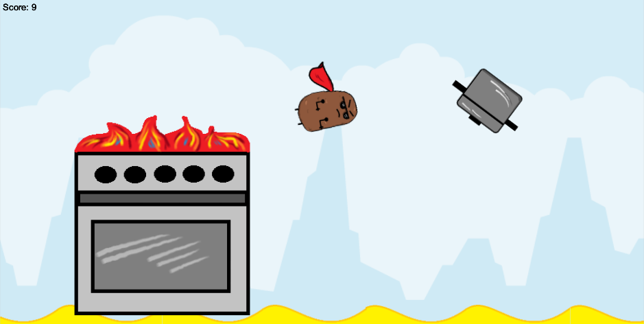

SpeeTato is a maniac speedy potato whos only goal is to destroy the world of fast food. He has to evade the arch enemy of every potato: frying pans, cooking pots and ovens.

SpeeTato is implemented using the game engine [Unity](https://unity.com), a cross-platform game engine. Within a weekend during an hackathon, we created a fully working 2D game that implements several stages and worlds. We won the 3rd price for our fully working solution.

In this project I gained experience with game development, design and associated technologies, including [C#/.NET](https://dotnet.microsoft.com/) for programming and the [Github](https://github.com) version control system for DevOps support. Among others working with music, assets and in a team under time pressure.
 
Source: <a href="https://github.com/knanw/SpeeTato/"><i class="large github icon"></i>SpeeTato</a> 