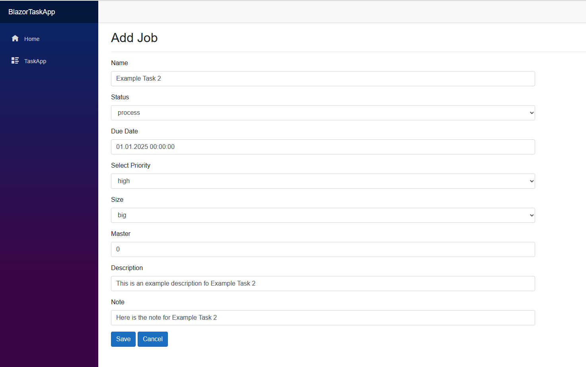
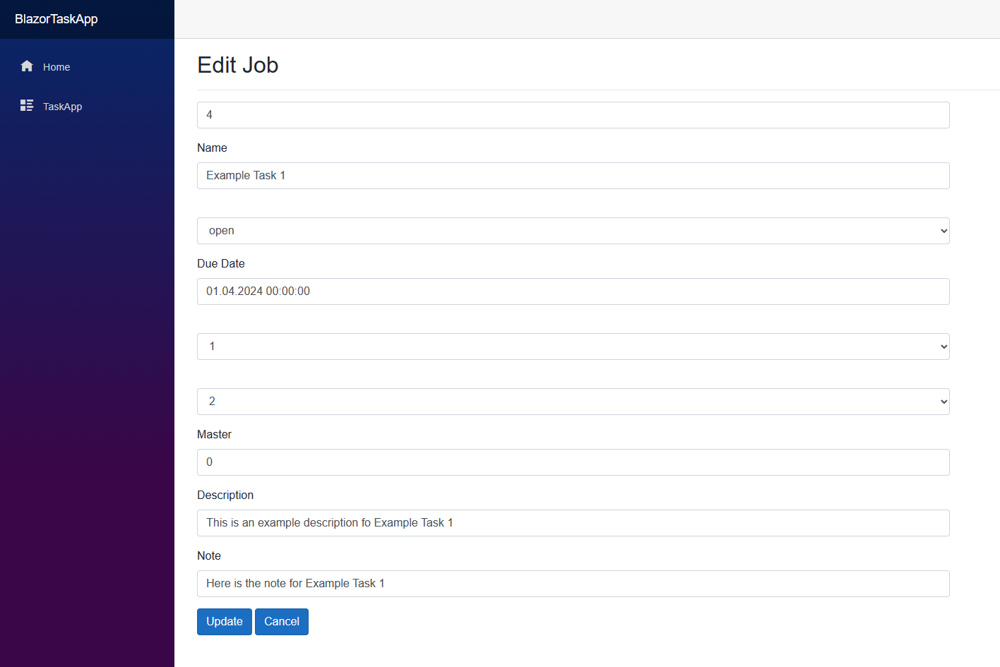

Teaser:
The prospective customer Sunshine Sunscreen, which could become a very important customer of ours in the future, has approached us with a request.
Sunshine sunscreen is in high season in the summertime, but they have an organizational problem due to a definite system collapse and ask us to get them out of the organizational chaos with a suitable task app (desktop or web).
Technologies used: .NET / C#, Visual Studio 2019, MS SQL Server

For this purpose, I analyzed in the first step what requirements a task app has to meet.
I made the following requirements for the data schema of a task, which fields it must have:
- id-number
- name for the task
- status of the task:
  - open 
  - process
  - closed
- due date
- priority of the task:
  - low 
  - middle 
  - high
 - task size:
  - small
  - average
  - big
 - master: if the task is a substask of another task
 - description
 - note for the task

This correspond to the following database table schema:
````sql
CREATE TABLE [dbo].[Jobs](
	[Id] [int] IDENTITY(1,1) NOT NULL,
	[Name] [nvarchar](max) NULL,
	[Status] [nvarchar](max) NULL,
	[DueDate] [datetime2](7) NOT NULL,
	[Priority] [nvarchar](max) NULL,
	[Size] [nvarchar](max) NULL,
	[Master] [int] NOT NULL,
	[Description] [nvarchar](max) NULL,
	[Note] [nvarchar](max) NULL,
 CONSTRAINT [PK_Jobs] PRIMARY KEY CLUSTERED )

````

For this project, I programmed the various capabilities for the task app. I started by installing, configuring and setting up the Blazor and ASP.NET project sceleton. I established a database connection to the Microsoft SQL server. I started with designing the data model by using the entity framework core. Afterwards I programmed the migration and service layer and added the migration by the following 2 commands:

````c#
add-migration initial
update-database
````

<div class="ui medium rounded images">
  
  
</div>

From there, I then programmed the basic CRUD operations like read, create, update, delete and the corresponding basic RESTful endpoints for GET, POST, PUT/PATCH and DELETE edit for the single page application. From the overview page with the list of tasks the user can directly add a new task in a new create window. For every task there is an edit and delete button which directs to different windows where the user can process tasks. I finished with implementing the different frontend pages with the Blazor Framework.


Here is some code that illustrates how I create the table for the tasks in the backend:

```c#
migrationBuilder.CreateTable(
    name: "Jobs",
    columns: table => new
    {
        Id = table.Column<int>(type: "int", nullable: false)
            .Annotation("SqlServer:Identity", "1, 1"),
        Name = table.Column<string>(type: "nvarchar(max)", nullable: true),
        Status = table.Column<string>(type: "nvarchar(max)", nullable: true),
        DueDate = table.Column<DateTime>(type: "datetime", nullable: false),
        Priority = table.Column<string>(type: "nvarchar(max)", nullable: true),
        Size = table.Column<string>(type: "nvarchar(max)", nullable: true),
        Master = table.Column<int>(type: "int", nullable: false),
        Description = table.Column<string>(type: "nvarchar(max)", nullable: true),
        Note = table.Column<string>(type: "nvarchar(max)", nullable: true)
    },
    constraints: table =>
    {
        table.PrimaryKey("PK_Jobs", x => x.Id);
    });
```

Source: <a href="https://github.com/knanw/TaskApp/"><i class="large github icon"></i>Blazor Task App</a> 

